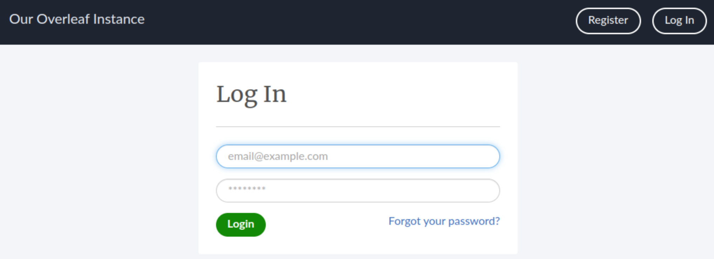
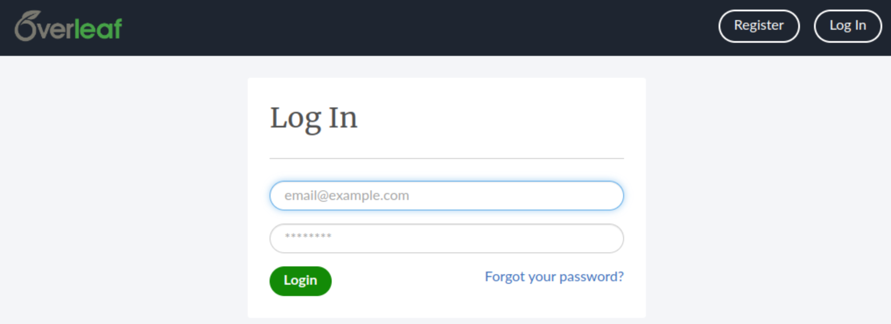
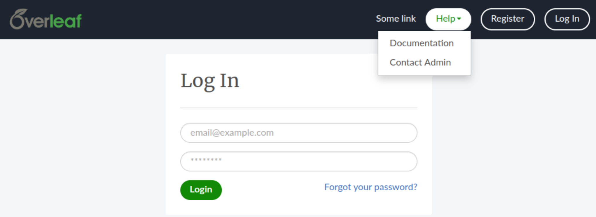

!!! important

    Starting with Overleaf CE/Server Pro `5.0.1` environment variables have been rebranded from `OVERLEAF_*` to `OVERLEAF_*`.

    If you're using a `4.x` version (or earlier) please make sure the variables are prefix accordingly (e.g. `OVERLEAF_NAV_TITLE` instead of `OVERLEAF_NAV_TITLE`)

## Header

In this section, you we'll cover how to personalize key elements of your {{ versions['server-pro-short'] }} instance. Using the following options you 
have the ability to customize the site title, navigation links, header, footer, and logo according to your preferences. 

### Site title

The navigation bar title can be customized with the `OVERLEAF_NAV_TITLE` environment variable, this text is used in the top left corner of navigation if no logo is set.

```bash
# add to config/variables.env
OVERLEAF_NAV_TITLE=Our Overleaf Instance
```



### Logo
You can add a custom logo rather than using text by setting the environment variable `OVERLEAF_HEADER_IMAGE_URL`. This value should point to an externally hosted image file.

```bash
# add to config/variables.env
OVERLEAF_HEADER_IMAGE_URL=https://mysite.somewhere.com/img/logo.png
```



### Header navigation links

Extra navigation items can be added to the navigation header by setting the `OVERLEAF_HEADER_EXTRAS` environment variable to a JSON array of objects. For example:

    [
      {
        "text": "Some link",
        "url": "http://example.com/somelink",
        "class": "subdued",
        "only_when_logged_out": true
      },
      {
        "text": "Help",
        "class": "subdued",
        "dropdown": [
          {
            "text": "Documentation",
            "url": "/learn"
          },
          {
            "text": "Contact Admin",
            "url": "http://example.com/contact"
          }
        ]
      }
    ]

    # add to toolkit/variables.env
    OVERLEAF_HEADER_EXTRAS=[{"text":"Some link","url":"http://example.com/somelink","class":"subdued","only_when_logged_out":true},{"text":"Help","class":"subdued","dropdown":[{"text":"Documentation","url":"/learn"},{"text":"Contact Admin","url":"http://example.com/contact"}]}]



## Footers

It is possible to customise both the left and smaller right footer which is found on pages like `/project` using the environmental variables `OVERLEAF_LEFT_FOOTER` and the smaller `OVERLEAF_RIGHT_FOOTER`

Both expect an array of JSON which will be inserted.

	[
		{
			"text": "Powered by <a href=\"https://www.sharelatex.com\">ShareLaTeX</a> © 2016"
		},{
			"text": "Another page I want to link to can be found <a href=\"here\">here</a>"
		}
	]

This data needs to be valid JSON to work, with quotes escaped when passed through as an environmental variable

```bash
# add to config/variables.env
OVERLEAF_LEFT_FOOTER=[{"text": "Powered by <a href=\"https://www.sharelatex.com\">ShareLaTeX</a> © 2016"},{"text": "Another page I want to link to can be found <a href=\"here\">here</a>"} ]
OVERLEAF_RIGHT_FOOTER=[{"text":"Hello I am on the Right"}]
```

