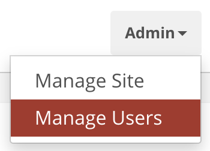
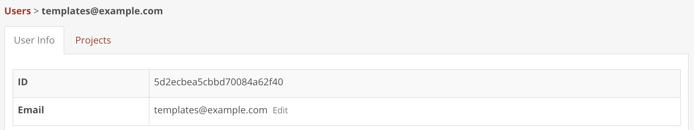
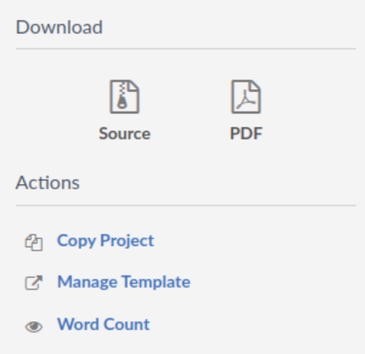
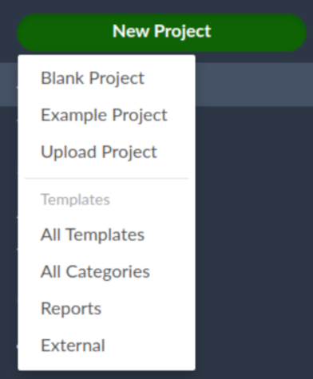

---
tags:
  - Server Pro
---

With {{ versions['server-pro-short'] }}, you have the ability to create and publish your own templates, within your self-hosted environment, as well as re-distribute downloaded templates from the [Template Gallery](https://www.overleaf.com/latex/templates) on [overleaf.com](https://www.overleaf.com). 

## Setting up the templates user ##

In {{ versions['server-pro-short'] }}, a single user is responsible for publishing the curated list of templates that are visible on your local template gallery `/templates`. 

To do this, you'll need to set the environment variable `SHARELATEX_TEMPLATES_USER_ID` in `toolkit/config/variables.env` to the `ID` of the user who will be responsible for template management within your instance, for example:

```bash
SHARELATEX_TEMPLATES_USER_ID=56a8865231faeb5f07d69959
```

To obtain the `ID` of the user you wish to publish public templates:

1. Log in using an Administrator account and go to `Admin` > `Manage Users`.

1. Search for the user using their email address and click through to their user admin page. There you will find the `ID`:

1. Copy that `ID` and use it to set the environment variable `SHARELATEX_TEMPLATES_USER_ID`.
1. Run `bin/up -d` to recreate the `sharelatex` container and apply the change.

!!! warning

    Altering the configuration files of your {{ versions['server-pro-short'] }} typically necessitates the recreation of one or more containers. This procedure will cause user disconnections and lead to a period of downtime. As such, we advise implementing these modifications during prearranged maintenance periods.

## Publishing templates ##

If you'd like to make templates available to all of your on-premise {{ versions['server-pro-short'] }} users you'll need to:

1. Log in as the **templates user**.
1. As the **templates user**, create or upload a project containing the template's source code and make sure it compiles.
1. In the editor's left-hand menu, choose **Manage Template**.

1. Enter a custom description of the template
1. Click the **Publish** button

!!! tip

    Did you know that you can transfer quality, pre-built LaTeX templates that are available on the [Template Gallery](https://www.overleaf.com/latex/templates) at [overleaf.com](https://www.overleaf.com) to your on-premise instance of {{ versions['server-pro-short'] }}? For more information see the [Transferring templates](https://www.overleaf.com/latex/templates) section below.

## Unpublishing templates ##

If you'd like to unpublish a template you'll need to:

1. Log in as the **templates user**.
1. Open the previously existing project containing the template's source code.
1. In the editor's left-hand menu, choose **Manage Template**.
1. Once the confirmation popup is displayed, click **Unpublish**.

Once this has been done, the template should have been removed from the templates list.

## Linking to your templates ##

### Your gallery ###

On the templates gallery page, `/templates`, templates are grouped together using the tag which the user assigns to the projects, e.g. Journals, Reports etc. To see all templates add `/all` to the URL `/templates/all`, which can also be used as the default URL if you do not wish to use tags for groupings.

Like-wise, you can view/link to templates within a specific category by appending the tag name to the templates URL, for example: `/templates/journals`.

!!! tip

    Did you know that if you tag a project multiple times it will appear in multiple groups.

### New project menu ###

When a user creates a new project, they can be shown customized links to template categories. These links are set via the  `SHARELATEX_NEW_PROJECT_TEMPLATE_LINKS` environment variable in `toolkit/config/variables.env`, for example:

```
SHARELATEX_NEW_PROJECT_TEMPLATE_LINKS='[
   {"name":"All Templates","url":"/templates/all"},
   {"name":"All Categories","url":"/templates"},
   {"name":"Reports","url":"/templates/reports"},  
   {"name":"External","url":"https://somewhere.com/templates/reports"}
]'
```



## Transferring templates from overleaf.com##

As {{ versions['server-pro-short'] }} has been architected to work offline, there isn't an automated way to integrate [overleaf.com](https://www.overleaf.com) gallery templates into your on-premise installation, it is however possible to do this manually on a per template basis.

By default, {{ versions['server-pro-short'] }} is configured to use a basic scheme version of TeXLive for compiles. This basic version is lightweight and only contains a very limited subset of LaTeX packages which, will most likely result in missing package errors for your users when attempting to use templates from [overleaf.com](https://www.overleaf.com) on your local on-premise instance.

Unfortunately, whilst there isn't an automatic way to install missing packages, we do have a configurable setting within {{ versions['server-pro-short'] }} that will allow your users to compile projects with access to more packages, and in a more secure way. This feature is called [Sandbox Compiles](sandboxed-compiles.md) (also known as Sibling Containers).

To ensure that downloaded templates are compatible with your on-premise {{ versions['server-pro-short'] }} instance, we highly recommend that you enable Sandbox Compiles as this feature will provide your users with access to the same TexLive environment as that on [overleaf.com](https://www.overleaf.com). These images contain the most popular packages and fonts and have already been tested against our gallery templates. 

You can find additional information about configuring what TeXLive versions users are able to choose from within their project along with setting the default TeXLive image version for new projects in the [Changing the TeXLive Image]() section of this documentation. 

!!! note

    Once you've switched to using [Sandbox Compiles](sandboxed-compiles.md) it'll take a little while for the new images to be downloaded by the container (this only happens once per image), during this time compiles will be unavailable.

If you'd like to re-distribute a template from the [Template Gallery](https://www.overleaf.com/latex/templates) on [overleaf.com](https://www.overleaf.com), or if one of your users would like to use one for their own project, the steps are as follows:

1. Navigate to the [Template Gallery](https://www.overleaf.com/latex/templates) on [overleaf.com](https://www.overleaf.com) and locate the required template, for example [IEEE Photonics Journal Paper Template - Example Submission](https://www.overleaf.com/latex/examples/ieee-photonics-journal-paper-template-example-submission/bsfjjfkdsjds)
1. Click on the **Open as Template** button
1. Click on the project menu and choose **Download Source**
1. Next, log into the on-premise {{ versions['server-pro-short'] }} account
1. Click the **New Project** button from the projects dashboard and choose **Upload Project**
1. Click the **Select a .zip file** button and choose the downloaded template zip file

The user can then use this newly uploaded template within their own account, or, as the templates user, you can publish it for other users to use.

!!! note

    An [overleaf.com](https://www.overleaf.com) account is required