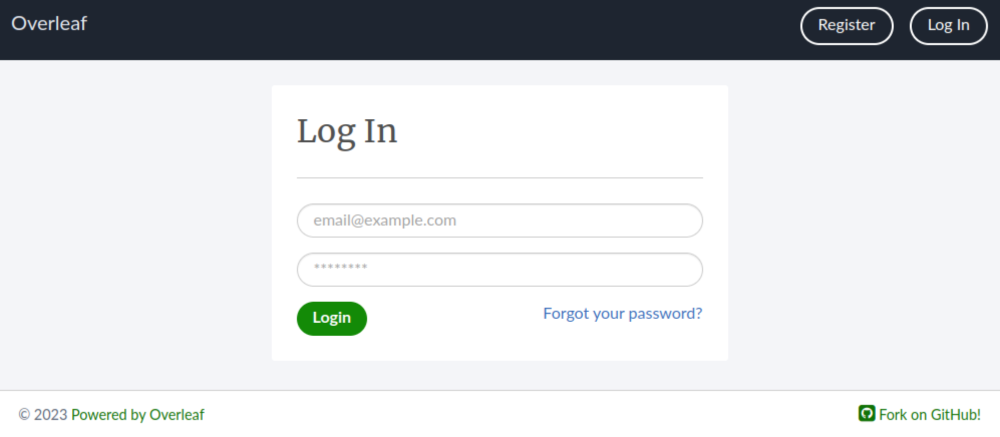

The {{ versions['toolkit-full'] }} is the recommended way to deploy and manage Overleaf {{ versions['community-edition-short'] }} and {{ versions['server-pro-short'] }} instances. 

In this section we will guide you through downloading the {{ versions['toolkit-short'] }} from GitHub, familiarizing yourself with some of the {{ versions['toolkit-short'] }}'s commands and configuring some basic settings. By the end of this page you should have a running {{ versions['community-edition-full'] }} instance.

## Downloading the {{ versions['toolkit-short'] }}

The {{ versions['toolkit-short'] }} is compatible with both the {{ versions['community-edition-short'] }} and {{ versions['server-pro-short'] }} and is the recommend installation method. Using the {{ versions['toolkit-short'] }} will allow you to easily get started with {{ versions['community-edition-short'] }} and seamlessly upgrade to {{ versions['server-pro-short'] }} if required.

To install the {{ versions['toolkit-short'] }} you'll need to navigate to the intended installation path and then clone the Overleaf {{ versions['toolkit-short'] }} GitHub repository using this command:

```
git clone https://github.com/overleaf/toolkit.git ./overleaf-toolkit
```

!!! tip

    To prevent any potential permissions issues we recommend installing the {{ versions['toolkit-short'] }} in your users `$HOME` directory.

Wait for the cloning process to complete then let's switch into the newly created `overleaf-toolkit` directory:

```
cd ./overleaf-toolkit
```

## Taking a look around

Now that we have a local copy of the {{ versions['toolkit-short'] }}, let's take a look at the structure of the repository using the `ls` command:

```
ls -l
```

!!! info

    The `ls -l` command displays a detailed long listing view of the contents of a directory, providing additional file information such as permissions, ownership and size.

If everything was cloned successfully you should see something like this:

```
drwxr-xr-x 3 fry fry  4096 Aug 30 14:16 bin
-rw-r--r-- 1 fry fry  6465 Aug 30 14:16 CHANGELOG.md
drwxr-xr-x 2 fry fry  4096 Sep  6 12:43 config
drwxr-xr-x 5 fry fry  4096 Aug 30 14:22 data
drwxr-xr-x 3 fry fry  4096 Aug 30 14:16 doc
drwxr-xr-x 3 fry fry  4096 Aug 30 14:16 lib
-rw-r--r-- 1 fry fry 34520 Aug 30 14:16 LICENSE
-rw-r--r-- 1 fry fry  1178 Aug 30 14:16 README.md
```

!!! note

    All user-owned configuration files are found in the `config/` directory. This directory is excluded from the git revision control system, so it will not be changed by updating the {{ versions['toolkit-short'] }}. 

| Name | Description | 
| --------------- | --------------- |   
| `bin` | This folder contains a collection of scripts that help you manage your Overleaf server instance. You can read more about these scripts in our [Commands]() section below.| 
| `config` | This folder contains your own local configuration files. | 
| `lib` | This folder contains base configuration files used by the {{ versions['toolkit-short'] }}. | 
| `data` | By default this folder contains the storage location for MongoDb, Redis and Overleaf. For more information see [Persistent data](https://github.com/overleaf/toolkit/blob/master/doc/persistent-data.md) section below. | 

!!! info

    The {{ versions['toolkit-short'] }} will not change any data in the `config/` directory without your permission.

## Initializing the configuration

Let's initialize our new servers configuration files with some sensible defaults by running the bundle `bin/init` script. 

```
bin/init
```

!!! info

    This script will not overwrite any existing configuration files.

Now lets check the contents of the `config/` directory using the `ls` command:

```
ls config
```
If everything was successfully initialized you should see three configuration files `overleaf.rc`,  `variables.env` and `version`. These are the main server configuration files and allow you to customize how your server operates and how your users interact with your instance.

| Name | Description | 
| ---- | ----------- |   
| `overleaf.rc` | The main top-level configuration file. | 
| `variables.env` | Environment variables loaded into the Docker container. | 
| `version` | The version of the Docker image to use. | 

!!! info

    For now it's enough to know that these files exist and where you can find them. Later on in the documentation we'll go through each of the files in more detail and explain how you can customize your instance using them. If you want to skip ahead you can see a full breakdown of these configuration files see our [Configuration]() section.

## Personalizing your instance

Before we start your Overleaf instance for the first time we're going to update the `config/variables.env` configuration file with your custom information.

Open the `config/variables.env` file using your favourite text editor and update each of the following environment variables with the required information.

| Name | Description | Example |
| ---- | ----------- | ------- |
| `OVERLEAF_SITE_URL` | Where your instance of Overleaf is publicly available. This is used in public links, and when connecting over websockets, so **must be configured correctly**! | https://overleaf.lilliput.com
| `OVERLEAF_EMAIL_FROM_ADDRESS` | This email address will be used as the `from` address for all outgoing emails. | no-reply@lilliput.com
| `OVERLEAF_ADMIN_EMAIL` | The email address where users can reach the person who runs the site. | it-services@lilliput.com

Once you have updated these environment variables, save and quit - you're now ready to start your instance for the first time.

To start your instance run the following command:

```
bin/up
```

This command will download all the required images, create the containers (using your customizations) and start up the instance. You should see some log output from the various Docker containers. You can start them up again (without attaching to the log output) by running `bin/start`.

!!! info

    The {{ versions['toolkit-full'] }} uses `docker compose` to manage the Overleaf Docker containers. The {{ versions['toolkit-short'] }} provides a set of scripts which wrap `docker compose`, and takes care of most of the details for you.

If all goes well, you should be able view the log in page for your new Overleaf instance by navigating to [http://127.0.0.1/](http://127.0.0.1/) or [http://localhost/](http://localhost/) in your browser.



!!! warning

    Depending on your network configuration and where your Overleaf instance is being hosted you may need to make some additional configuration changes. See the [Configuration](/configuration) section for more details.

That's it for the initial part of installation. You can now move onto the [Post installation tasks](/installation/post-installation-tasks/) where you'll [Create your first administrator account](/installation/post-installation-tasks/#creating-your-first-administrator-account) and [First example project](/installation/post-installation-tasks/#creating-your-first-example-project).